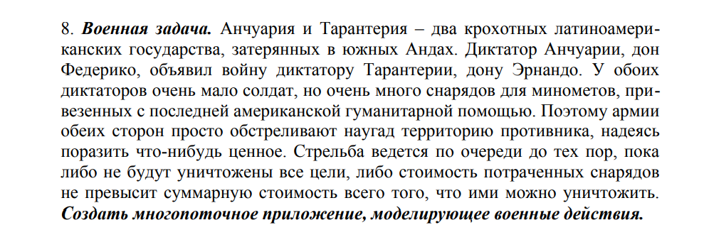

# Домашнее задание 4. Вариант 8
## _Нарин Алексей, БПИ217_

*Критерии выполнены на оценку 4.*

### Описание решения
Реализован класс Страна (State), имеющий два экземпляра, обозначающих Анчуарию и Тарантерию.   
Каждая страна имеет карту (state_map), на которой случайно расположены здания.  
Страны многократно "атакуют" друг друга, то есть выбирают случайную из неатакованных клеток на карте противника. Если там здание, оно разрушается, если нет - снаряд тратится впустую.  
Атаки прекращаются когда суммарная стоимость оставшихся зданий не превышает суммарную стоимость израсходованных боеприпасов.  

### Ввод
Позволяется вручную ввести любые неотрицательные цены на боеприпасы и здания каждой из стран, либо использовать дефолтные.  
Ввод осуществляется через консоль.

### Параллельные вычисления
Каждая страна атакует другую независимо, в отдельном потоке.   
Программа завершается после завершения обоих потоков, показав итоговые карты государств, где разрушенные здания отмечены х  
Использован итеративный параллелизм, т.к. потоки практически идентичные, содержат циклы и не пересекаются областями используемой памяти.
